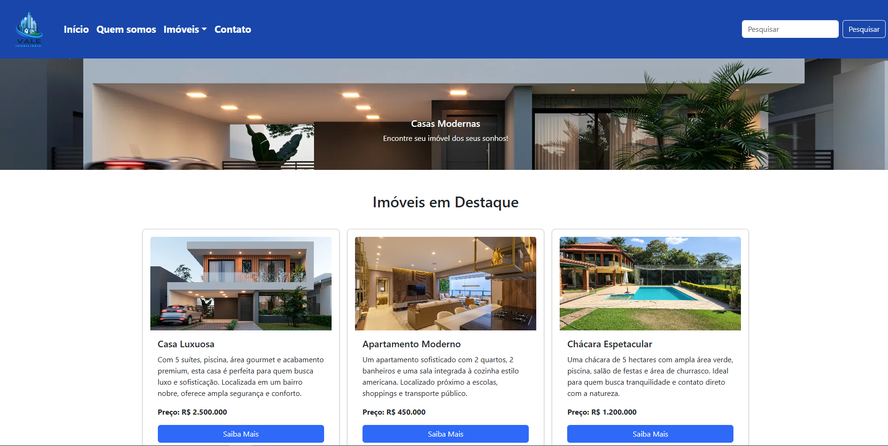
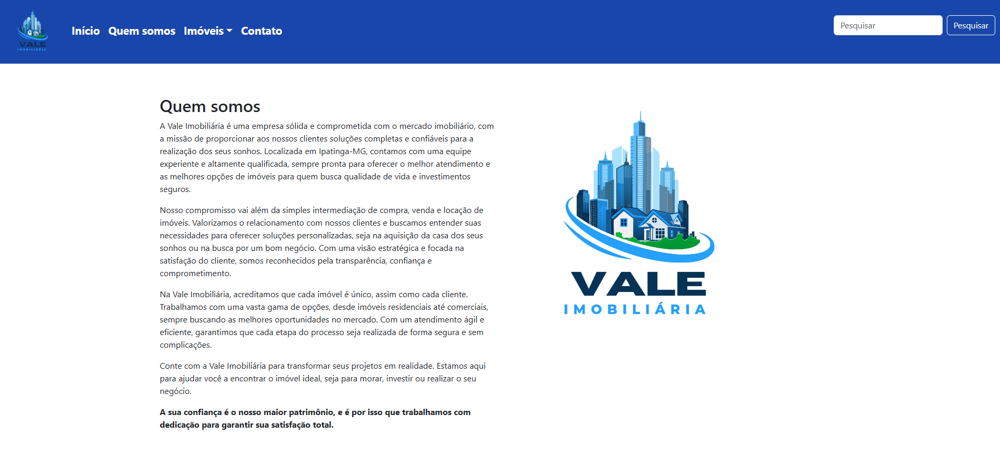
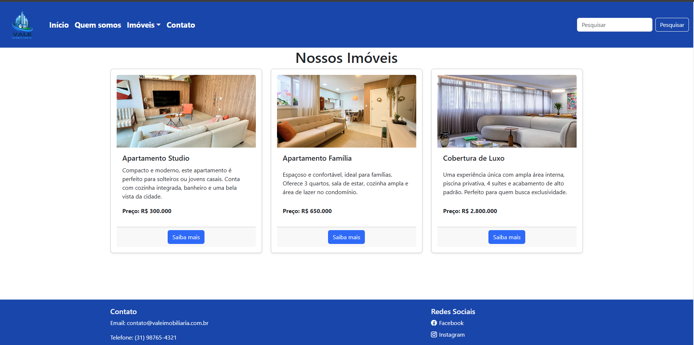
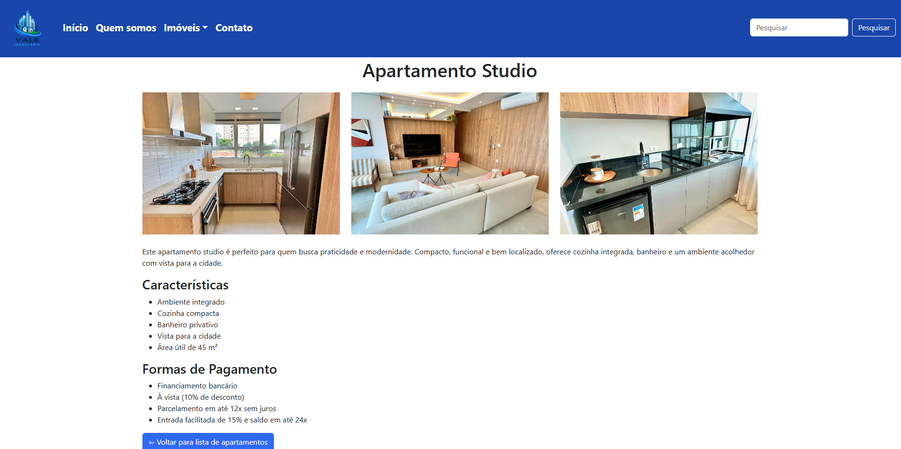
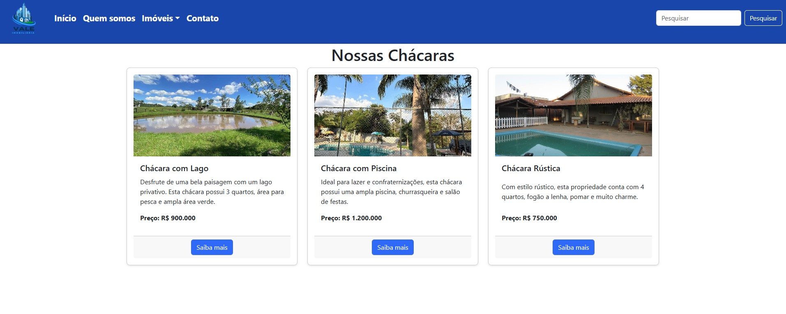
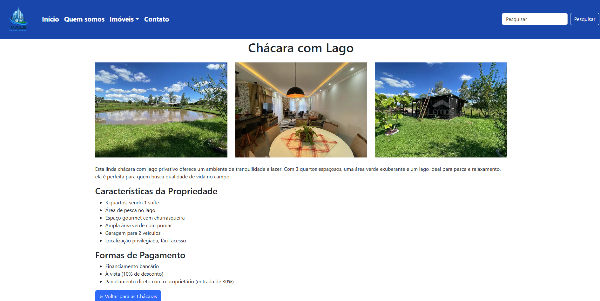
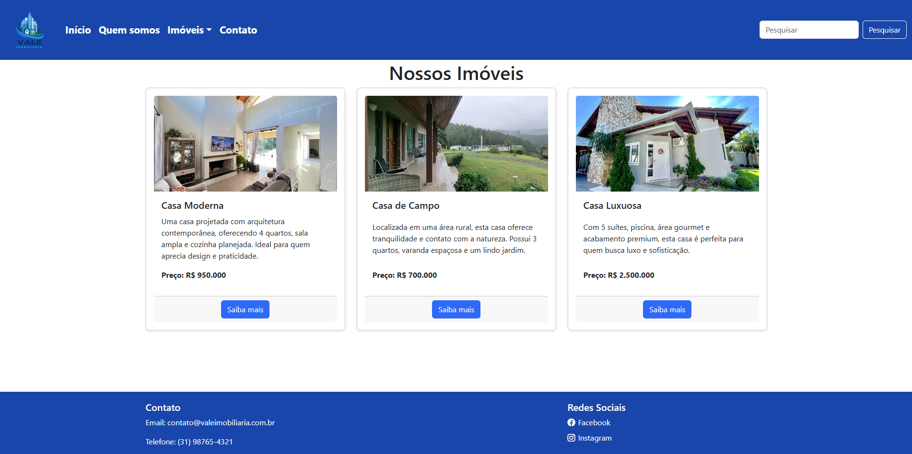
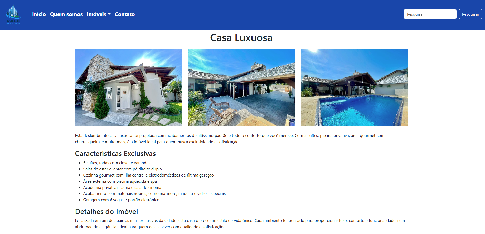
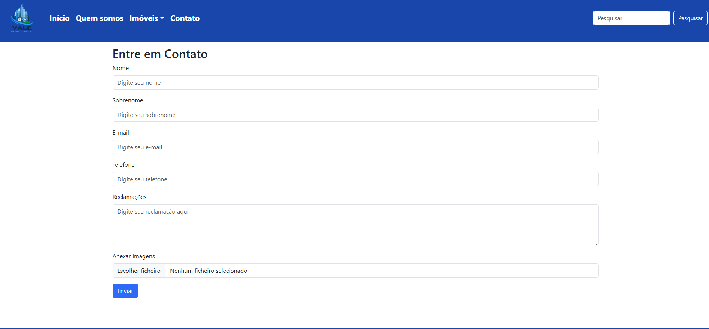

# Vale_Imobiliaria

# README - Vale Imobiliária

## Recursos Utilizados

- **HTML5**: Estruturação da página web.
- **CSS3**: Estilo visual da página.
- **Bootstrap 5**: Framework CSS para criar layouts responsivos e componentes prontos (ex: navbar, cards, carrossel, botões).
- **Bootstrap Icons**: Ícones para redes sociais e elementos de navegação.
- **JavaScript (Bootstrap Bundle)**: Interatividade do carrossel de imagens e componentes interativos.
  
## Etapas Implementadas

1. **Estrutura HTML**
   - A página foi construída com a estrutura básica de HTML5, com as seções principais como: `header`, `main`, e `footer`.
   - Utilização de tags semânticas para melhor organização e SEO.

2. **Navegação e Menu**
   - Criação de um menu de navegação com **navbar** do Bootstrap.
   - Inclusão de links para diferentes seções do site, como **Início**, **Quem Somos**, **Imóveis**, e **Contato**.
   - Implementação de um menu dropdown para diferentes tipos de imóveis (Apartamentos, Chácaras, Casas).

3. **Carrossel de Imagens**
   - Implementação do carrossel de imagens que exibe imóveis em destaque.
   - O carrossel é interativo e permite navegação entre as imagens de forma automática ou manual (com botões "Anterior" e "Próximo").

4. **Seção de Imóveis em Destaque**
   - Exibição de três imóveis em destaque com suas respectivas informações (preço, descrição e imagem).
   - Cada imóvel possui um link que redireciona o usuário para uma página com mais detalhes.

5. **Rodapé**
   - Inclusão de informações de **Contato** e links para as **Redes Sociais**.
   - Implementação de ícones do **Facebook** e **Instagram** utilizando o Bootstrap Icons.

## Backlog

   1. **Sistema de Busca Avançada**:
   - Implementar filtros de pesquisa para que os usuários possam buscar imóveis por tipo, preço, localização, etc.

   2. **Área do Cliente**:
   - Implementar uma área para clientes se registrarem e acompanharem imóveis de interesse.

## Conclusão

Este projeto proporcionou a criação de uma página inicial funcional e visualmente agradável para uma imobiliária. A utilização do **Bootstrap** acelerou o desenvolvimento, garantindo que a página fosse responsiva e interativa sem a necessidade de códigos complexos. A estrutura de navegação está bem definida, com links para seções importantes e um carrossel que destaca os principais imóveis.

